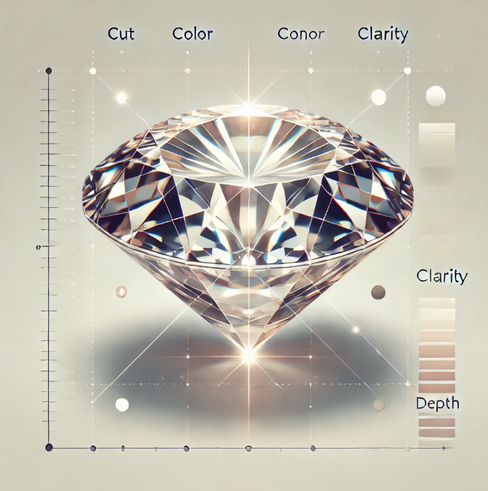

# Diamond_Price_Prediction

Link to the dataset: https://www.kaggle.com/datasets/shivam2503/diamonds

The dataset includes features such as color, clarity, depth, and table, with price being the target variable to predict. 

The relationship between dimensions (x, y, z) and price was analyzed. Categorical variables were label-encoded to make them suitable for modeling. Outliers were identified, and data preprocessing was performed. Pipelines combining a standard scaler and various regression models were constructed to determine the best-performing model. The optimal model was then tested on the test set and evaluated using metrics like R² score, adjusted R² score, MAE, MSE, and RMSE.

