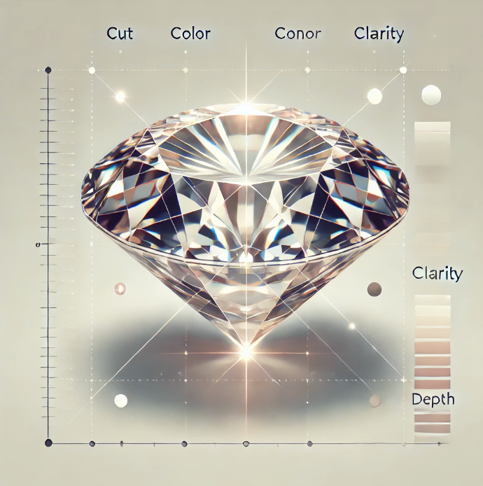

# Diamond Price Predictor

This project aims to predict the price of diamonds using various regression techniques. By analyzing nearly 54,000 diamond records, the model learns the relationship between a diamond's physical properties (like the 4 Cs: Carat, Cut, Color, Clarity) and its market value.



### Dataset
The project utilizes the Diamonds dataset, containing records for approximately 53,940 diamonds with 10 descriptive attributes.

Link to the dataset: https://www.kaggle.com/datasets/shivam2503/diamonds

### Features
The model evaluates several key attributes, famously known as the 4 Cs, alongside physical dimensions:

### The 4 Cs:
1. Carat: The weight of the diamond (0.2–5.01).

2. Cut: Quality of the cut (Fair, Good, Very Good, Premium, Ideal).

3. Color: Diamond color, from J (worst) to D (best).

4. Clarity: Measurement of how clear the diamond is (I1 (worst) to IF (best)).

### Dimensions & Others:
1. x, y, z: Length, width, and depth in mm.

2. Depth: Total depth percentage.

3. Table: Width of the top of the diamond relative to the widest point.

4. Price (Target): The price in US dollars ($326–$18,823).

### Data Preprocessing

To ensure model accuracy, the following steps were performed:

1. Data Cleaning: Removed the unnecessary index column (Unnamed: 0).

2. Outlier Removal: Filtered out "dimensionless" diamonds where x, y, or z values were zero.

3. Feature Encoding: Applied LabelEncoder and OneHotEncoder to convert categorical text data into numerical formats.

4. Scaling: Standardized features using StandardScaler.

5. Dimensionality Reduction: Utilized Principal Component Analysis (PCA) to simplify the dataset.

### Machine Learning Models

The project implements a pipeline to compare various regression algorithms:

1. Linear Regression

2. Decision Tree Regressor

3. Random Forest Regressor

4. XGBoost Regressor (Final model used for prediction)

5. K-Neighbors Regressor

### Evaluation Metrics

The models were evaluated using the following metrics to ensure high precision:

1. R² Score: To measure the goodness of fit.

2. Adjusted R²: To account for the number of predictors.

3. MAE: Mean Absolute Error.

4. MSE: Mean Squared Error.

5. RMSE: Root Mean Squared Error.

### Installation & Usage
1. Install dependencies:
```Bash
pip install numpy pandas seaborn matplotlib scikit-learn xgboost
```
2. Run the Analysis
   Open diamond-price-predictor.ipynb in Jupyter or VS Code to see the full modeling process.


